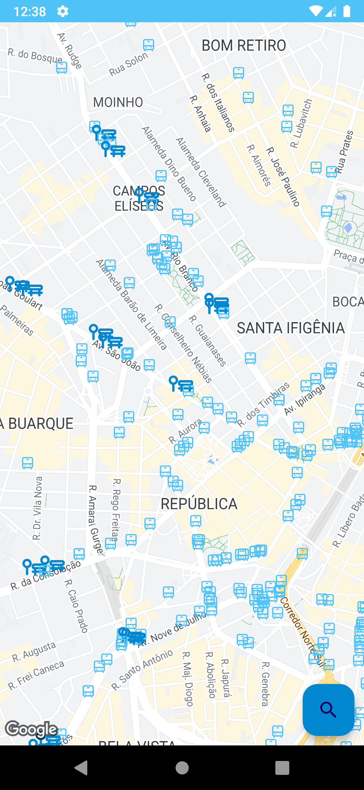

# SPBus

Aplicativo que usa da <a href= "https://www.sptrans.com.br/desenvolvedores/api-do-olho-vivo-guia-de-referencia/documentacao-api/#docApi-previsao">Api da SPTrans</a> para
obter informações sobre onibus, paradas, linha e previsão de chegada na cidade de São Paulo para preencher informações no mapa e em listas.

## Features do app:

<ul>
  <li> Mostra no mapa paradas e posições atuais dos ônibus
  <li> Clicando em uma parada exibe a previsão de chegada de cada onibus por linha
  <li> Filtra no mapa paradas e os ônibus
  <li> Pesquisa e mostra informações sobre as linhas
</ul>

## Bibliotecas usadas

<ul>
  <li> Retrofit2
  <li> SDK Maps
  <li> RecyclerView
  <li> Koin
</ul>

E alem das bibliotecas o aplicativo usa MVVM + Clean Code

      

